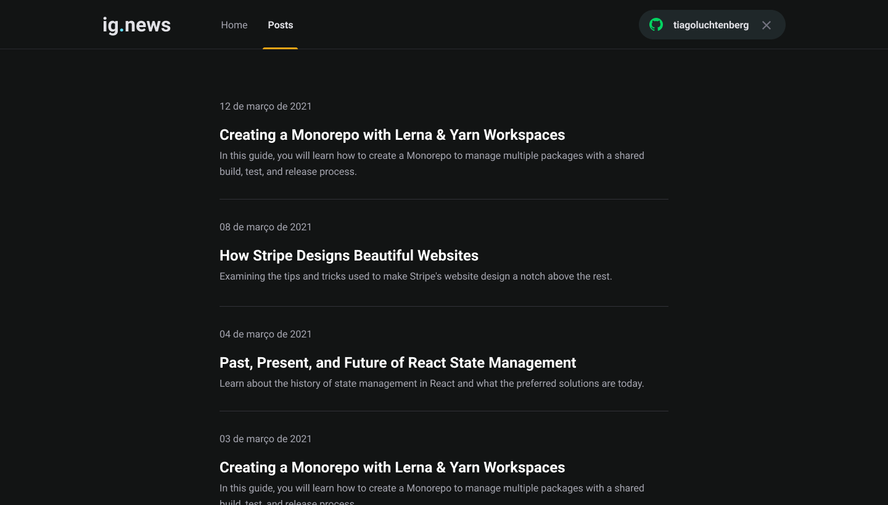

<h1 align="center">
  
</h1>

<p align="center">
  <a href="#-projeto">Projeto</a>&nbsp;&nbsp;&nbsp;|&nbsp;&nbsp;&nbsp;
  <a href="#-layout">Layout</a>&nbsp;&nbsp;&nbsp;|&nbsp;&nbsp;&nbsp;
  <a href="#-tecnologias-utilizadas">Tecnologias Utilizadas</a>&nbsp;&nbsp;&nbsp;|&nbsp;&nbsp;&nbsp;
  <a href="#-como-executar">Como executar</a>&nbsp;&nbsp;&nbsp;|&nbsp;&nbsp;&nbsp;
  <a href="#-licença">Licença</a>
</p>

<p align="center">
  

 
</p>

<br>

<p align="center">
  
  
</p>

## 💻 Projeto

Projeto feito em NextJs, para a criação de um blog.

Realizado pela **[@Rocketseat](https://github.com/Rocketseat)** durante o Ignite, trilha ReactJS.

<br/>

## 🔖 Layout

Você pode visualizar o layout do projeto através [desse link](https://www.figma.com/file/kXxOlSOmW1YvYuhRrFvIaU/ig.news?node-id=1%3A2). É necessário ter conta no [Figma](http://figma.com/) para acessá-lo.

<br/>

## ✨ Tecnologias utilizadas

Esse projeto foi desenvolvido com as seguintes tecnologias:

- [React](https://reactjs.org)
- [TypeScript](https://www.typescriptlang.org/)
- [Fauna DB](https://fauna.com/)
- [Stripe](https://stripe.com/br)
- [Prismic CMS](https://prismic.io/)

<br/>

## 🚀 Como executar

- Você precisa instalar o [Node.js](https://nodejs.org/en/) e [Yarn](https://yarnpkg.com/) para executar este projeto.

**Clone o projeto**

```bash
  git clone https://github.com/Glerme/ignews.git
```

**Siga os passo abaixo**

```bash
  #Instale as dependências
  yarn

  #Execute o projeto
  yarn start
```

O aplicativo estará para acesso em seu navegador em: `http://localhost:3000`

<br/>

## 📄 Licença

Esse projeto está sob a licença MIT. Veja o arquivo [LICENSE](LICENSE) para mais detalhes.

---

<a href="https://glerme.github.io">
 
 <br />
 <sub><b>Guilherme Felipe</b></sub></a>

Feito com ❤️ por Guilherme Felipe 👋🏽 Entre em contato!

[](https://twitter.com/glhermme) [](https://www.linkedin.com/in/glerme/)
[](mailto:guiggff@gmail.com)
